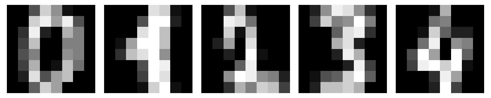
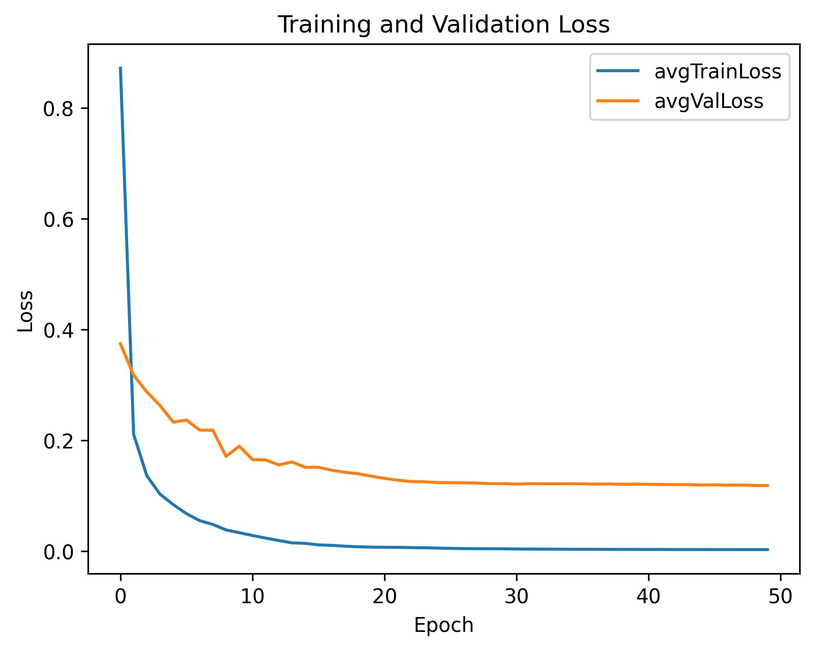
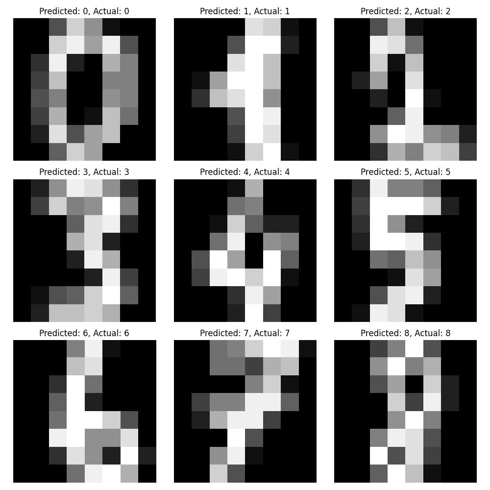
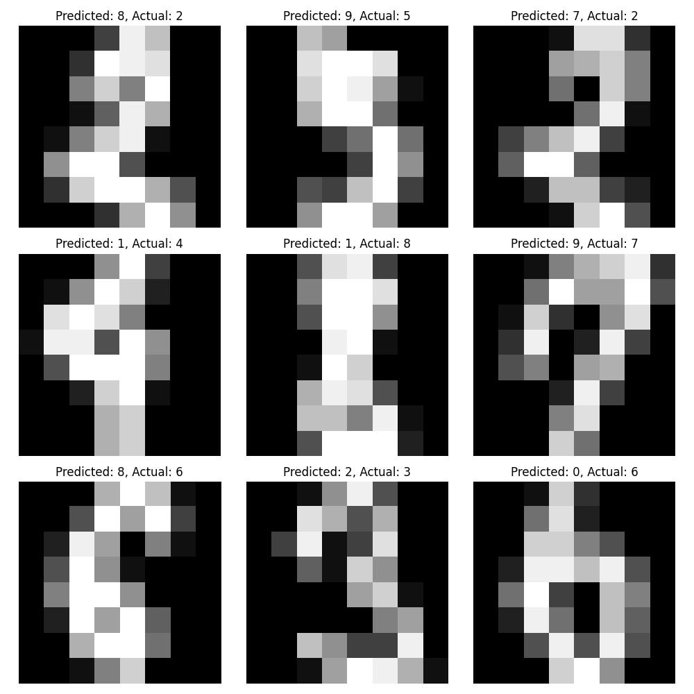

# 🧠 j-neural-core


A lightweight Java implementation of a multi-layer perceptron (MLP) neural network — from scratch — with autograd, training, and examples of classification models built on top of the MLP class. 

The project successfully trains a digit recognizer model achieving over 96% test accuracy, demonstrating its practical viability despite being written entirely without external ML libraries.

## 📦 Features

* Fully custom autograd engine (Value class)
* Multi-Layer Perceptron (MLP) architecture
* Stochastic Gradient Descent (SGD) training loop
* **Automatic switching** between:
  - Binary classification: Sigmoid activation + Binary Cross-Entropy loss
  - Multiclass classification: Softmax activation + Categorical Cross-Entropy loss  
* Binary classification example with simple data
* Digit classification using processed handwritten digit dataset
* Serializing (saving) model objects into .model text file as list of parameters (weights and biases)
* Loading and initializing parameters of saved models
* L2 regularization, learning decay, and early stopping mechanism
* Clean Maven-based project structure

## 📁 Folder Structure

```bash
j-neural-core/
├── src/main/
│   ├── java/
│   │   ├── app/
│   │   │   └── Main.java               # Entry point to run both classifiers
│   │   ├── core/
│   │   │   ├── Layer.java
│   │   │   ├── MLP.java                # Neural network model
│   │   │   ├── Neuron.java
│   │   │   └── Value.java              # Autograd engine
│   │   ├── data/
│   │   │   └── DigitDataLoader.java    # Loads and parses digit dataset
│   │   ├── engine/
│   │   │   └── Trainer.java            # Trainer class with activation/loss switching logic
│   │   └── models/
│   │       ├── BinaryClassifier.java   # Binary classification using sigmoid + BCE
│   │       ├── DigitRecognizer_0.96438.model   # Saved parameters of the best trained model
│   │       └── DigitRecognizer.java    # Multiclass digit recognition using softmax + CE
│   └── resources/data/
│       ├── digits_original.txt
│       ├── digits_test.csv
│       ├── digits_train.csv
│       └── digits_validation.csv
├── .gitignore
├── README.md
└── pom.xml
```

## 📊 DigitRecognizer

### Dataset

5620 samples split into:
* Training = 3374 samples (~60%)
* Validation = 1123 samples (~20%)
* Testing = 1123 samples (~20%)

The **DigitRecognizer** model uses the [*Optical Recognition of Handwritten Digits* dataset](https://archive.ics.uci.edu/dataset/80/optical+recognition+of+handwritten+digits), originally collected by:  
**E. Alpaydin, C. Kaynak**  
Department of Computer Engineering  
Boğaziçi University, Istanbul, Turkey  
(July 1998)

This dataset is provided by the UCI Machine Learning Repository in a **preprocessed 8×8 format**, where the original 32×32 bitmaps were downsampled by dividing into 4×4 non-overlapping blocks and **counting the number of active pixels (value 1) in each block**. This results in inputs with integer values between 0–16, reducing dimensionality while preserving useful features. All input values were later **normalized to the 0–1 range** by dividing by 16.

The training, validation and testing CSV files are located in `src/main/resources/data/`.

### Results

The best test accuracy of **96.34%** was achieved **under 30 minutes of training** locally on Apple MacBook M4 Pro with these hyper-parameters:
* 0.007 learning rate
* 150 epochs
* 64 input neurons, 2 hidden layers of [64, 32] neurons, 10 output neurons
* L2 regularization with lambda = 1e-4
* After 100 epochs learning rate decay by 0.9 every 10 epochs
* 6570 model parameters total

#### Training & Validation Loss Curve
Loss curve is displayed for the **first 50 epochs** out of total 150 epochs to better illustrate the initial convergence:




Such accuracy is expected for this dataset as stated in the [source of the dataset](https://archive.ics.uci.edu/ml/datasets/Optical+Recognition+of+Handwritten+Digits). It is most likely limited by the reduced dimensionality of the input data and by the architecture of the created classifier model.

The final loss data were:
* **Total training loss** = 11.22817344
* **Average training loss** = 0.00332785
* **Total validation loss** = 102.04086267
* **Average validation loss** = 0.09086453

Out of 1123 test samples, only 40 of them were not classified correctly. Most common (interchanged) misclassified digits were:
* 1 <-> 8
* 2 <-> 3
* 5 <-> 7
* 7 <-> 9
* 8 <-> 9

### Sample Predictions

Correctly classified digits:



Misclassified digits with predictions:




## 🚀 Getting Started

### Prerequisites

- Java 17+
- Maven 3.x
- Git (optional)

### Clone the Repo

```bash
git clone http://github.com/samuel-soltys/j-neural-core
cd j-neural-core
```

### Build and run the project (DigitRecognizer demo)

```bash
mvn compile
mvn exec:java -Dexec.mainClass="app.Main"
```

You can also run the individual models directly by setting their class as the entry point:

```bash
mvn exec:java -Dexec.mainClass="models.BinaryClassifier"
mvn exec:java -Dexec.mainClass="models.DigitRecognizer"
```

## 🧪 Classification Logic

* **Auto-switching logic** is based on the number of output neurons:
  - If output layer has **1 neuron**, use Sigmoid + Binary Cross-Entropy loss.
  - If output layer has **>1 neurons**, use Softmax + Categorical Cross-Entropy loss.
* Models:
  - `BinaryClassifier`: Predicts binary labels using hidden ReLU layers and sigmoid output.
  - `DigitRecognizer`: Predicts digits (0–9) using softmax output with 10 neurons.

## 📝 License

This project is open source and available under the MIT License.

---

Project inspired by [micrograd](https://github.com/karpathy/micrograd) by Andrej Karpathy